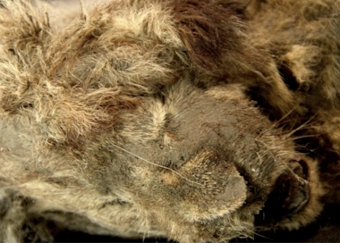

## Scientist: Ice Age lion cub in 'near-perfect condition'

It's believed the two cave lion cubs — each the size of a full-grown house cat — were about a month or two old when they died.

[Strange quirk about their deaths »](https://www.yahoo.com/news/scientists-unveil-extinct-ice-age-175300043.html)
