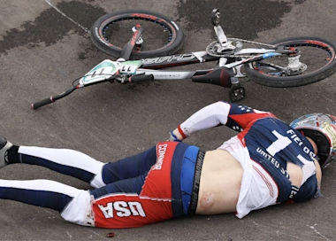

## 'Do people realize I nearly died?'

U.S. BMX rider Connor Fields suffered a brain hemorrhage, broken ribs and a collapsed lung and spent five days at St. Luke's International Hospital in Tokyo following a horrific crash.

[Not ready to commit to Paris in 2024 »](https://www.yahoo.com/sports/bmx-rider-connor-fields-not-sure-about-paris-after-brain-injury-in-tokyo-do-people-realize-i-nearly-died-084033787.html)
