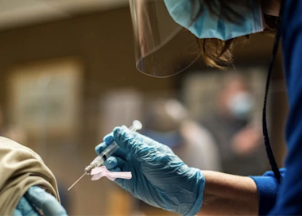

## Your paycheck may shrink if you refuse a COVID shot

Tyson Foods, United Airlines, CNN and the military are requiring COVID shots, and experts believe they'll have a lot more company soon.

[Possible penalties »](https://www.yahoo.com/finance/news/wont-covid-vaccine-bosses-may-050106083.html)
