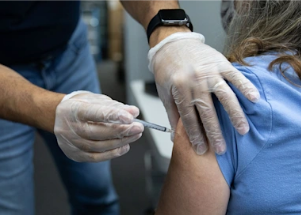

## Unvaccinated Americans point fingers at vaccinated

Just 6 percent of those who remain unvaccinated say they deserve “the most blame for the new surge of COVID cases in the U.S.," a Yahoo News/YouGov poll shows.

[See all the results »](https://www.yahoo.com/news/poll-more-unvaccinated-americans-blame-vaccinated-americans-for-the-delta-surge-than-blame-themselves-194934930.html)
