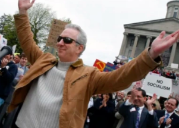

## Radio host dies of COVID, regretting vaccine skepticism

Conservative talk radio host Phil Valentine, who had been a vaccine skeptic until he was hospitalized with COVID-19, died at age 61, Nashville radio station WTN confirmed.

['He would tell you, "Go get vaccinated"' »](https://www.yahoo.com/news/radio-host-regretted-vaccine-hesitancy-004349441.html)
