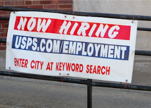

## The 1 benefit many workers won't give up: Survey

Almost two-thirds of remote workers or those looking for a remote job say they are prepared to take a 5 percent pay cut to work from home, according to a new survey.

['Employers need to have flexibility' »](https://www.yahoo.com/money/workers-are-ready-to-give-up-pay-and-benefits-to-stay-remote-161008740.html)
