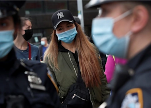

## What the largest study of masks yet reveals

A study involving more than 340,000 people in Bangladesh offers some of the strongest real-world evidence yet that mask use can help communities slow COVID-19.

['This is really solid data' »](https://www.yahoo.com/news/largest-study-masks-yet-details-023712519.html)
