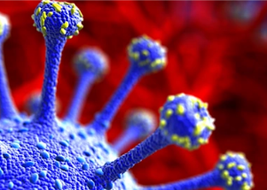

## There's a new variant. How worried should we be?

A new coronavirus variant has emerged from South Africa. It has a high number of mutations but has a way to go before it challenges the highly contagious Delta variant.

['Mutations of interest' »](https://www.yahoo.com/news/c-1-2-coronavirus-variant-204839864.html)
