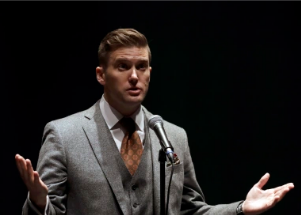

## How a small town responded to a neo-Nazi campaign

Richard Spencer, a summer resident in the town of Whitefish, Mont., once boasted that he stood at the vanguard of a white nationalist movement. Things have changed.

[Emboldened by Trump's victory in 2016 »](https://www.yahoo.com/news/small-town-silenced-neo-nazi-155555240.html)
