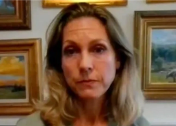

## Fighter pilot's would-be 9/11 suicide mission

On Sept. 11, 2001, then-Air Force Lt. Heather Penney was sent to intercept hijacked United Airlines Flight 93 before it reached Washington, D.C. She understood what needed to be done.

[''Dear God, don't let me mess this up' »](https://www.yahoo.com/gma/fighter-pilot-reflects-9-11-180343760.html)
