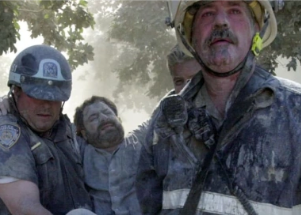

## Photographer still searching for his 9/11 'guardian angel'

Twenty years after he was rescued from the rubble of the World Trade Center, photographer David Handschuh said he is still seeking the identity of a firefighter who helped him survive.

['Don't worry, brother, we'll get you out' »](https://www.yahoo.com/news/photographer-hunts-9-11-guardian-164742086.html)
