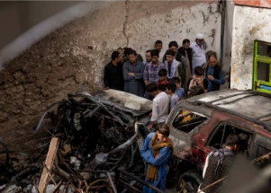

## New evidence raises doubts about U.S. version of strike

The U.S. military called it a “righteous strike” against a vehicle thought to carry a bomb, but the New York Times identified the driver as a longtime worker for a U.S. aid group.

[Strike killed 10, including 7 children »](https://www.yahoo.com/news/times-investigation-us-drone-strike-140449695.html)
