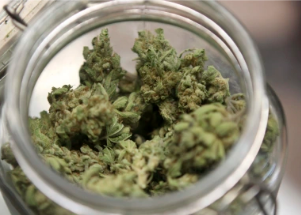

## Case of mom charged with neglect could set precedent

Many believe the outcome of Lindsay Ridgell's case is likely to set a precedent for how Arizona and the rest of the nation consider marijuana use during pregnancy.

['I just could not keep food down' »](https://www.yahoo.com/news/case-arizona-mom-charged-child-162204844.html)
