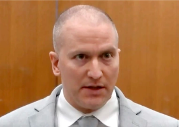

## George Floyd's killer raises 14 issues about his prosecution

Former Minneapolis police officer Derek Chauvin, who was jailed for murder in June, has filed an intent to appeal with the Minnesota state appellate court.

[Landmark verdict challenged »](https://www.yahoo.com/news/derek-chauvin-appeal-conviction-sentencing-072215608.html)
