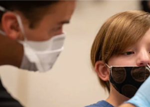

## The huge implications to vaccinating younger kids

Vaccinating as many kids ages 5 to 11 as possible could have an outsize impact not just for their parents but for everyone, say experts. Here's how the strategy works.

[Changing the risk from 'very low to zero' »](https://www.yahoo.com/news/covid-vaccines-for-younger-kids-could-be-the-secret-to-ending-the-us-pandemic-090008822.html)
