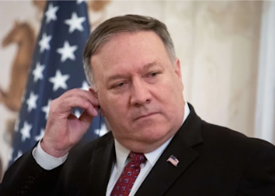

## Trump officials 'were seeing blood' over CIA data loss

An investigation has revealed one of the most contentious intelligence debates of the Trump presidency and exposes new details about the U.S. government's war on WikiLeaks.

[Assange's lawyer issues response »](https://www.yahoo.com/news/kidnapping-assassination-and-a-london-shoot-out-inside-the-ci-as-secret-war-plans-against-wiki-leaks-090057786.html)
