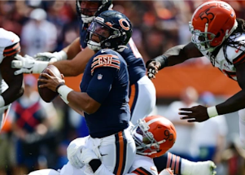

## Rookie QB pays for Bears coach's major mistake

Coach Matt Nagy's insistence on using five-man protections gave rookie QB Justin Fields no chance to get clean looks, and he completed just six passes against the Browns.

[7 sacks come on 3rd down »](https://www.yahoo.com/sports/browns-sack-bears-qb-justin-fields-nine-times-in-his-first-nfl-start-200347953.html)
