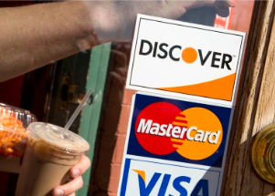

## Experts eye troubling trend in U.S. credit card debt

Spending is ticking back up — and the results are starting to show up on Americans' monthly credit card statements.

[Also on the upswing? Auto loans »](https://www.yahoo.com/finance/news/americans-spend-credit-card-debt-040000728.html)
