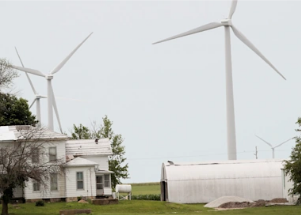

## Battered by climate change, state to ban fossil fuels

Illinois Gov. J.B. Pritzker signed a landmark law this month that will shift the state to 100 percent clean energy by 2045.

[How the transition will work »](https://www.yahoo.com/news/illinois-becomes-first-midwestern-state-to-plan-fossil-fuel-phaseout-190947145.html)
