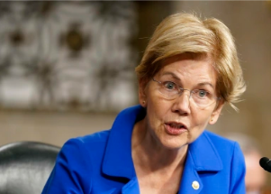

## Warren to Powell: 'I will oppose your renomination'

Pressing Federal Reserve Chair Jerome Powell on his record on financial regulation, Sen. Elizabeth Warren said she wouldn't support him for a second term.

[His term expires in February »](https://www.yahoo.com/finance/news/warren-says-she-opposes-dangerous-153415910.html)
