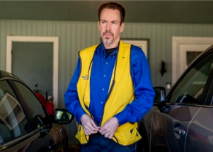

## A Walmart job amid COVID: 'It's become hostile'

For Walmart employees like Peter Naughton — and many other frontline workers across the U.S. — the pandemic never shut down their jobs. It just made them harder.

['Every day Is frightening' »](https://www.yahoo.com/news/every-day-frightening-working-top-183740590.html)
