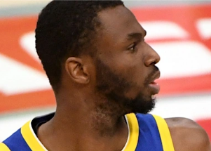

## NBA player who refused to get COVID vaccine relents

Andrew Wiggins of the Warriors, who'd been prohibited from entering the team's arena, has received the COVID-19 vaccine, Golden State coach Steve Kerr told reporters.

[Denied a religious exemption »](https://www.yahoo.com/sports/steve-kerr-says-andrew-wiggins-has-taken-covid-19-vaccine-will-be-allowed-at-home-games-191745719.html)
