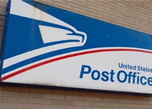

## USPS considering a massive new line of business

The Postal Service quietly began offering paycheck-cashing services last month, a change that experts say could dramatically alter how low-wage Americans access money.

[Alternative to predatory payday lenders »](https://www.yahoo.com/news/usps-testing-paycheck-cashing-could-151059024.html)
