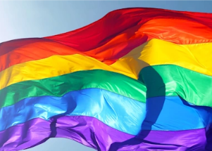

## Schools are banning an old-school 'safe place' sign

Reasons given by administrations for flag removal have often been vague, sometimes blaming the flags for "significant disruption" or being too "political."

['Value the most vulnerable among us' »](https://www.yahoo.com/lifestyle/rainbow-flags-classrooms-safe-space-schools-banning-them-203720801.html)
