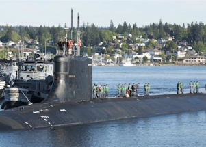

## U.S. nuclear submarine hits unknown object in Pacific

A U.S. Navy nuclear-powered attack submarine was in "safe and stable" condition after it collided with an unknown submerged object in the Pacific Ocean, officials said.

[‘No life-threatening injuries’ »](https://www.yahoo.com/gma/us-navy-submarine-uss-connecticut-210350491.html)
