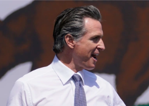

## New class students must take to graduate in California

Gov. Gavin Newsom signed a bill requiring all California students to take a class that highlights the contributions of groups that have experienced racism and marginalization.

[Critics across the political spectrum »](https://www.yahoo.com/news/california-becomes-first-state-require-211846366.html)
