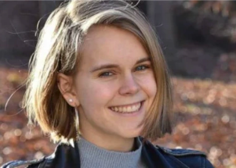

## Teen gets the maximum in notorious N.Y. murder case

Luchiano Lewis was sentenced to the maximum of nine years to life in prison for his role in the 2019 murder of Barnard College freshman Tessa Majors, 18.

[2 other teens involved »](https://www.yahoo.com/gma/teen-sentenced-maximum-killing-barnard-193800528.html)
