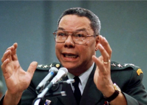

## Experts: Powell's death wasn't due to vaccine failure

The death of general and statesman Colin Powell from COVID-19 complications should not lead to any concerns about the efficacy of the coronavirus vaccines, experts said.

[Blood cancer left him vulnerable »](https://www.yahoo.com/news/colin-powells-death-doesnt-challenge-efficacy-of-coronavirus-vaccines-173102331.html)
