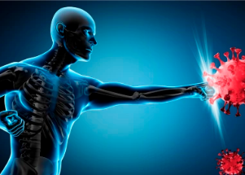

## How some now have 'super-immunity' against COVID

A growing body of research suggests that previous coronavirus infection plus vaccination provides the strongest protection against COVID-19.

[Findings from the latest studies »](https://www.yahoo.com/news/natural-immunity-good-getting-vaccinated-093009241.html)
