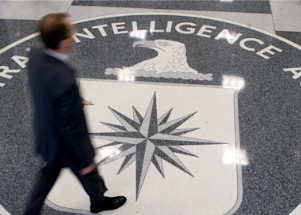

```
--- BEGIN LICENSE KEY ---
ctA3AbDvw-xvJd3GcK+3o1jAGgAtm9+ul3JViSOIQxWJdT1+rJxnngIAVt7h7ylmWBVnMXwLUJqfQDvipetZRS6bXIMGUsRY4FqZu5G3PvF1O0G9+UVDweJLVtebYAXlc7nH0Aut7cjF12lsoU1mTQzFbHUO1HoKI5WCa+r7jzq+Q-ON6MiKhPgJU0E9cflGPvB8xX8k1W5tQZOIbKpcmJAQTDulIAakWzQtWGLj5e4gg-gc5XGdfdarSdhnuxmv7GXv7-wW0EK++pRtUUeQLz+AB+LFhbb8QWKyurLpGkXhP3bMSjVGp4IAxoBfhNnp1qyGuZJjJvjvsm-DP56lTE++
--- END LICENSE KEY -----
```


## CIA forces out officer known as the 'Prince of Darkness'

The spy agency's outgoing Iran chief, Mike D’Andrea, has had a career that former colleagues consider among the most consequential in the CIA's recent history.


['The grim reaper for the enemy' »](https://www.yahoo.com/news/the-grim-reaper-for-the-enemy-ci-as-legendary-iran-chief-forced-to-retire-181856895.html)
