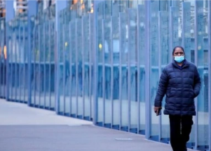

## World's most restricted city prepares to exit lockdown

Millions of people in Melbourne, Australia, are readying to come out of the world's longest COVID-19 lockdown, even as cases hover near record levels.

[6th lockdown of pandemic »](https://www.yahoo.com/news/melbourne-readies-exit-worlds-longest-231929451.html)
