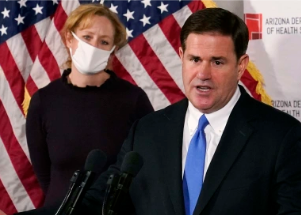

## 'It's bad': Health experts worry about Ariz. crisis

Arizona has caught up to New York when it comes to reported deaths per capita — even though the latter was ravaged by COVID early in the pandemic.

['We've hit a brick wall' »](https://www.yahoo.com/news/arizonas-pandemic-outlook-worries-experts-124533464.html)
