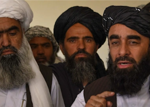

## Taliban's demand to the world: 'Give us our money'

Afghanistan parked about $9 billion in assets overseas with the U.S. Federal Reserve and banks in Europe, but that money has been frozen since the Taliban took control.

[New rulers warn of humanitarian disaster »](https://www.yahoo.com/finance/news/just-us-money-taliban-push-084759860.html)
