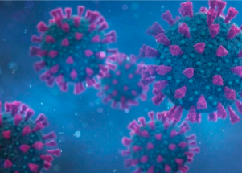

## Newly declassified intel report on COVID origins

U.S. intelligence agencies are unlikely to be able to draw a firm conclusion about the origin of COVID-19 without more information, according to a new report.

[2 theories, both plausible »](https://www.yahoo.com/news/origin-virus-may-remain-murky-155149425.html)
