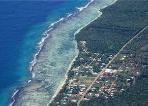

## Small island nation locks down after 1st virus case

Tonga's main island will go into lockdown for a week after the South Pacific nation reported its first case of the coronavirus.

[Traveler from New Zealand tested positive  »](https://www.yahoo.com/news/tongas-main-island-locks-down-072657040.html)
