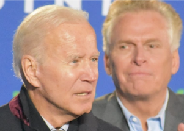

## Biden after Virginia defeat: 'People are upset'

After predicting Democrat Terry McAuliffe would win the governor's race, the president was left to contemplate why Republican Glenn Youngkin was able to prevail.

[Was his stalled agenda to blame? »](https://www.yahoo.com/news/biden-virginia-governors-race-213124131.html)
