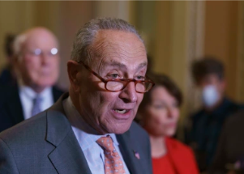

## 'This is a low, low point in the history of this body'

The Senate majority leader forced another test vote on legislation to overhaul the nation's election laws. For the fourth time since June, Republicans blocked it.

['The Senate is better than this' »](https://www.yahoo.com/news/senate-dems-push-voting-bill-195615339.html)
