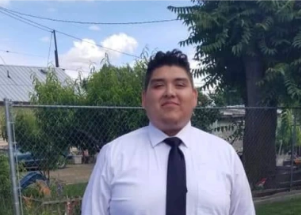

## 'I wished to God I was wrong, but I knew it was him'

Edgar Acosta recognized the white sneaker first. Then he saw the photo of his son Axel's lifeless face circulating on social media after the incident at Astroworld.

[Axel Acosta was 1 of 8 killed  »](https://www.yahoo.com/news/son-attended-astroworld-spent-next-195120209.html)
