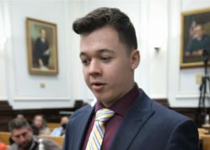

## Not just a matter of homicide at Rittenhouse trial

The 12 jurors must consider six criminal counts hinging on the question of whether Kyle Rittenhouse was acting in self-defense when he shot three men, two fatally.

[Judge tosses a curveball  »](https://www.yahoo.com/news/jury-must-weigh-complex-legal-151502912.html)
