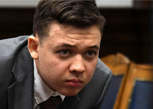

## Expert: Rittenhouse trial may be the 'tipping point back'

As the trial draws to a close, one expert says the verdict could see the country's social justice reckoning that peaked with George Floyd swing back in the other direction.

['The case that vindicates white people' »](https://www.yahoo.com/news/kenosha-hopes-calm-kyle-rittenhouse-014803668.html)
