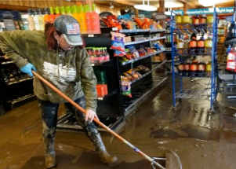

## 'They're losing all of their belongings again'

People in one corner of Washington are weary after enduring a deadly heat wave, a brutal drought and historic rain that further devastated their hard-hit communities.

['It could happen every year' »](https://www.yahoo.com/news/flooding-washington-state-leaves-residents-093023325.html)
