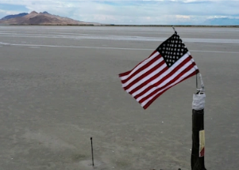

## Experts' repeated warnings on Great Salt Lake now true

Climate change is ravaging Utah's Great Salt Lake, with extreme drought leaving its water level at an all-time low, prompting habitat loss and worsening air quality.

[Prominent Republican responds »](https://www.yahoo.com/news/climate-change-has-helped-turn-utahs-great-salt-lake-into-a-puddle-of-its-former-self-192543423.html)
