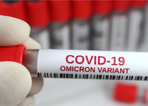

## Omicron has scientists altering stance on boosters

A number of health experts who opposed the White House’s campaign on COVID-19 boosters now support it because of additional data and the threat posed by Omicron.

[WHO’s position unchanged »](https://www.yahoo.com/news/omicron-prompts-swift-reconsideration-boosters-190548961.html)
