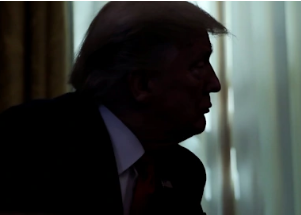

## Nationwide recall for COVID treatment drug Trump took

Biopharmaceutical company Gilead Sciences issued a recall of two lots of its drug remdesivir due to the "presence of glass particulates," it was announced.

['Veklury' administered to Trump last year »](https://www.yahoo.com/finance/gilead-recalls-vials-remdesivir-covid-122120730.html)
