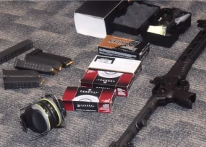

## College students may have thwarted mass shooting

Two students at a Florida university reported disturbing Snapchat messages about an alleged "plot to shoot up" the campus, leading to the arrest of a 19-year-old student.

[Was carrying a collapsible rifle, ammunition »](https://www.yahoo.com/news/students-reporting-alarming-snapchat-messages-102609153.html)
