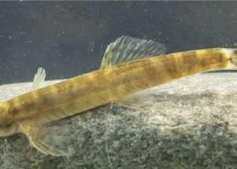

## 'Batman' fish, feared extinct for 5 decades, rediscovered

The Batman River loach, little more than an inch long and last seen by scientists in southeastern Turkey in 1974, just turned up in the nets of a fish taxonomist.

[Was on '10 Most Wanted Lost Species' list »](https://www.yahoo.com/news/feared-extinct-nearly-half-century-152634327.html)
