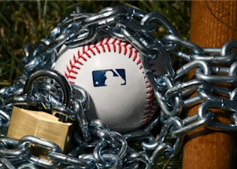

## Facing a pivotal moment, will MLB actually care about fans?

Will the baseball owners prioritize the on-field product over immediate financial gain in order to build back the sport's popularity? Well, apparently not.

[Hannah Keyser's column »](https://www.yahoo.com/sports/consider-the-fans-why-mlb-could-and-should-make-rule-changes-a-major-part-of-cba-talks-034106883.html)
