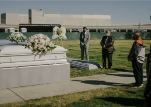

## 1 of every 100 older Americans has died from COVID

They are in one of the most-vaccinated groups, but people 65 and older make up about three-quarters of the nation’s coronavirus death toll.

[The heightened risk dominates life »](https://www.yahoo.com/news/u-nears-800-000-virus-130041903.html)
