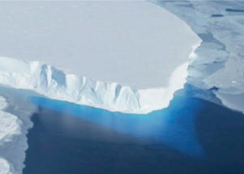

## 'Doomsday glacier': Scientists issue dire warning

An Antarctic glacier the size of Florida is on the verge of collapse — a nightmare scenario that could eventually result in several feet of global sea level rise, scientists say.

['Kind of a monster' »](https://www.yahoo.com/news/antarcticas-doomsday-glacier-is-facing-threat-of-imminent-collapse-scientists-warn-220236266.html)
