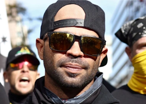

## Proud Boys' shift in strategy called 'concerning'

The far-right nationalist group has become increasingly active at school board meetings and town council gatherings across the U.S.

['Think local, act local' »](https://www.yahoo.com/news/proud-boys-regroup-focusing-school-194530907.html)
